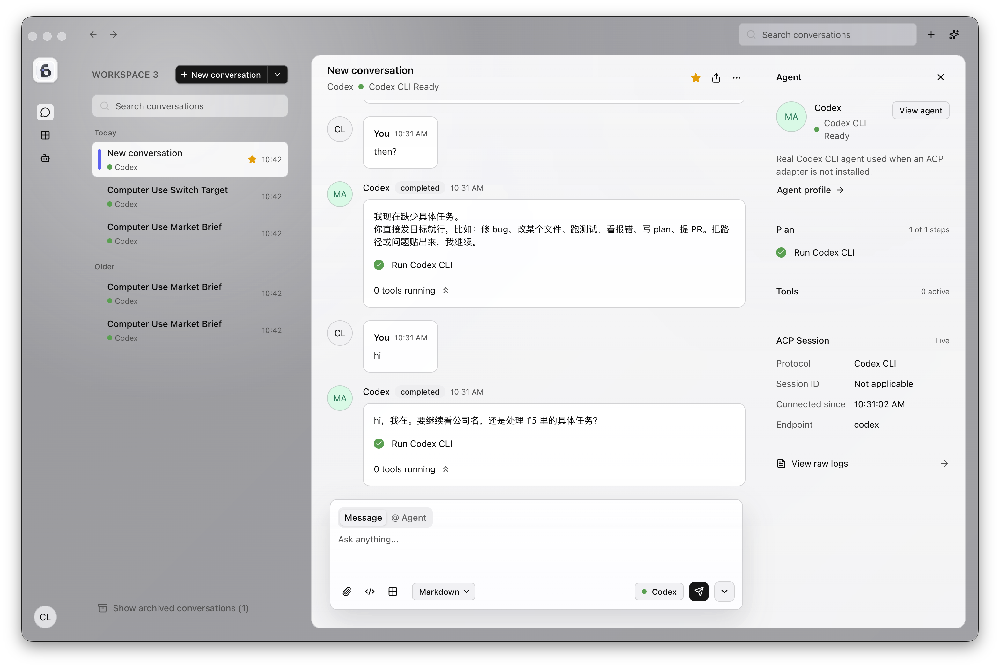

# F5

F5 is a local AI workspace for talking with coding agents, tracking their work, and keeping every conversation as Markdown files on disk.



## What It Does

- Multi-conversation workspace with a searchable conversation list.
- Markdown-backed conversation storage under the local workspace folder.
- Workspace-level TODO lists backed by local Markdown files, with task Agent assignment.
- Workspace-level Markdown documents with automatic save, edit, and preview.
- Real Codex CLI agent integration with queued prompts and visible agent progress.
- Agent side panel for plan steps, tool activity, session details, and raw logs.
- Conversation actions for star, rename, archive, delete, export, and showing file location.
- Profile, agent, workspace overview, theme switching, and macOS menu support.

## Stack

- Electron desktop shell
- React + Vite renderer
- pnpm workspace tooling
- Tailwind CSS + shadcn/ui
- ESLint, Prettier, Husky, lint-staged
- OpenSpec for product and implementation specs
- Vitest for unit and integration tests

## Local Development

```bash
pnpm install
pnpm dev
```

The development app opens as an Electron window and serves the renderer at `http://localhost:5173/`.

## Scripts

- `pnpm dev`: run the Electron app in development mode.
- `pnpm build`: type-check and build the Electron main, preload, and renderer bundles.
- `pnpm check`: run type-check, lint, format check, 80% unit coverage, and OpenSpec validation.
- `pnpm test`: run Vitest tests.
- `pnpm test:coverage`: run Vitest with 80% statement, function, and line coverage thresholds.
- `pnpm format`: format the project.
- `pnpm smoke:product`: run the product smoke test.
- `pnpm smoke:codex-acp`: run Codex ACP discovery and verification.

## Local Data

F5 stores workspace data in the app support folder:

```text
~/Library/Application Support/F5/workspace
```

Each conversation is stored as a folder with:

- `conversation.md`: conversation metadata frontmatter.
- `messages/*.md`: one Markdown file per message.
- `state.json`: queue, agent plan, tools, and session state.
- `attachments/`: local files attached to the conversation.

Workspace resources are stored beside conversations:

- `tasks/*.md`: one Markdown-backed TODO item per file.
- `tasks/lists/*.md`: one Markdown-backed TODO list per file.
- `tasks/index.json`: derived TODO index.
- `tasks/lists/index.json`: derived TODO list index.
- `documents/*.md`: one Markdown document per file.
- `documents/index.json`: derived document index.

Use `Help > Show Workspace Folder` in the app menu to open the workspace folder directly.

## Code Comments

- Functions over 40 lines must have a leading comment that explains what the function does and why it needs that shape.
- Keep comments focused on intent, edge cases, and non-obvious behavior. Do not repeat what the code already says.
